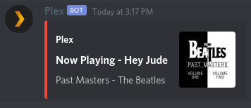

# Plex-Bot

[](http://perso.crans.org/besson/LICENSE.html)


<a href="https://github.com/psf/black"></a>

A Python-based Plex music bot for discord.



## Setup

Plex-Bot runs entirely in a Docker container. Ensure you have Docker and docker-compose installed according to the official Docker [documentation](https://docs.docker.com/get-docker/).

1.  Create a new folder and `cd` into it:

```
$ mkdir Plex-Bot
$ cd Plex-Bot
```

2.  Make a `docker-compose.yml` file or use this sample:

```yml
version: "3"
services:
  plex-bot:
    container_name: "PlexBot"
    image: jarulsamy/plex-bot:latest
    environment:
      - PUID=1000
      - PGID=1000
      - TZ=America/Denver
    # Required dir for configuration files
    volumes:
      - "./config:/config:ro"
    restart: "unless-stopped"
```

3.  Create a configuration folder:

Create a new `config` folder and create a config file like this:

```
$ mkdir config
$ cd config
```

```yml
# Create a file called config.yaml with the following contents

root:
  log_level: "info"

discord:
  prefix: "?"
  token: "<BOT_TOKEN>"
  log_level: "debug"

plex:
  base_url: "<BASE_URL>"
  token: "<PLEX_TOKEN>"
  library_name: "<LIBRARY_NAME>"
  log_level: "debug"
```

4.  Create a Discord bot application:

    * Go to the Discord developer portal, [here](https://discord.com/developers/applications).

    * Log in or create an account

    * Click New App

    * Fill in App Name and anything else you'd like to include

    * Click Create App
        This will provide you with your Client ID and Client Secret

    * Click Create Bot User
        This will provide you with your bot Username and Token

    * Fill in the bot token in `config/config.yaml`

5.  Get your plex token:

     * Refer to the official [plex documentation](https://support.plex.tv/articles/204059436-finding-an-authentication-token-x-plex-token/).

     * Add it to `config/config.yaml` in the appropiate spot.

6.  Customize remaining settings

    Set any remaining settings in the config file that you would like. Such as music library, and base url of the Plex server.

7. Start the service:

```
$ docker-compose up -d
```

## Logs

You can view the logs with the following command

```
$ docker-compose logs -f CONTAINER_NAME_OR_ID

# For example
$ docker-compose logs -f PlexBot
```

## Usage

```
General:
  kill - Stop the bot.
Plex:
  np - View currently playing song.
  pause - Pause currently playing song.
  play - Play a song from the Plex library.
  resume - Resume a paused song.
  skip - Skip a song.
  stop - Stop playing.
​No Category:
  help   Shows this message

Type ?help command for more info on a command.
You can also type ?help category for more info on a category.
```

## Support

Reach out to me at one of the following places!

-   Email (Best) at joshua.gf.arul@gmail.com
-   Twitter at <a href="http://twitter.com/jarulsamy_" target="_blank">`@jarulsamy_`</a>

* * *
